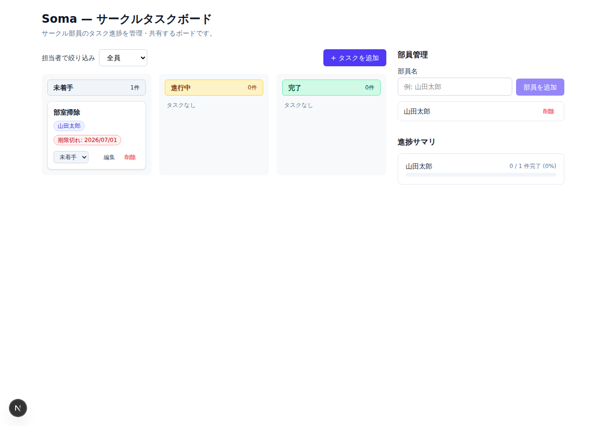

# Soma — サークルタスクボード

サークル部員のタスク進捗を管理・共有するためのタスク共有アプリ。



## 機能

- 📋 **カンバンボード** — 未着手 / 進行中 / 完了 の3カラム。カード上でステータス変更
- ✏️ **タスク管理** — タイトル・説明・担当部員・期限を設定。期限切れは赤色表示
- 👥 **部員管理** — 部員の追加・削除
- 📊 **進捗サマリ** — 部員ごとの担当タスク数・完了率
- 🔍 **フィルタ** — 担当者で絞り込み

## 起動方法

```bash
npm install
cp .env.example .env.local   # SUPABASE_URL / SUPABASE_SERVICE_ROLE_KEY を設定
```

Supabase プロジェクトを作成し、SQL Editor で `supabase/schema.sql` を実行してからテーブルを用意してください。

```bash
npm run dev
```

http://localhost:3000 を開く。

## 技術構成

- Next.js 15 (App Router) + TypeScript + Tailwind CSS v4
- データ層: Supabase（PostgreSQL, PostgREST 経由の HTTPS アクセス。生の Postgres TCP 接続は使わない）

## API（v2: プロジェクト → タスク → 工程(step) の階層 + 進捗履歴）

| Method | Path | 説明 |
|---|---|---|
| GET / POST | `/api/projects` | プロジェクト一覧（タスク数集計付き） / 作成 |
| GET / PATCH / DELETE | `/api/projects/:id` | プロジェクト取得 / 更新 / 削除（タスク・工程も cascade 削除） |
| GET | `/api/projects/:id/activities` | プロジェクトの進捗履歴（新しい順、最大50件） |
| GET / POST | `/api/tasks` | タスク一覧（`?projectId=` `?assigneeId=` `?status=` で絞り込み）/ 作成（`project_id` 必須） |
| PATCH / DELETE | `/api/tasks/:id` | タスク更新（部分更新可）/ 削除 |
| GET / POST | `/api/tasks/:id/steps` | タスクの工程一覧 / 追加 |
| PATCH / DELETE | `/api/steps/:id` | 工程更新（`done` 切替など）/ 削除 |
| GET | `/api/tasks/:id/activities` | タスクの進捗履歴 |
| GET | `/api/stats?projectId=` | 部員別の担当数・完了数（`projectId` 省略時は全プロジェクト集計） |
| GET / POST | `/api/members` | 部員一覧 / 追加 |
| DELETE | `/api/members/:id` | 部員削除（担当タスクは未割当に戻る） |

フィールドは snake_case（`assignee_id`, `due_date`, `project_id`）。`status` はタスクが `todo` / `doing` / `done`、プロジェクトが `active` / `archived`。
更新系エンドポイントは body に任意で `actor_id` / `actor_name` を渡すと、進捗履歴（activities）に記録されます。

## 開発

```bash
npm test        # vitest（データ層・APIエラーマッピング）
npm run lint    # eslint
npm run build   # 本番ビルド
```

## 注意

- 認証はありません（部内利用のMVP想定）。インターネットに公開する場合は認証の導入を検討してください。
